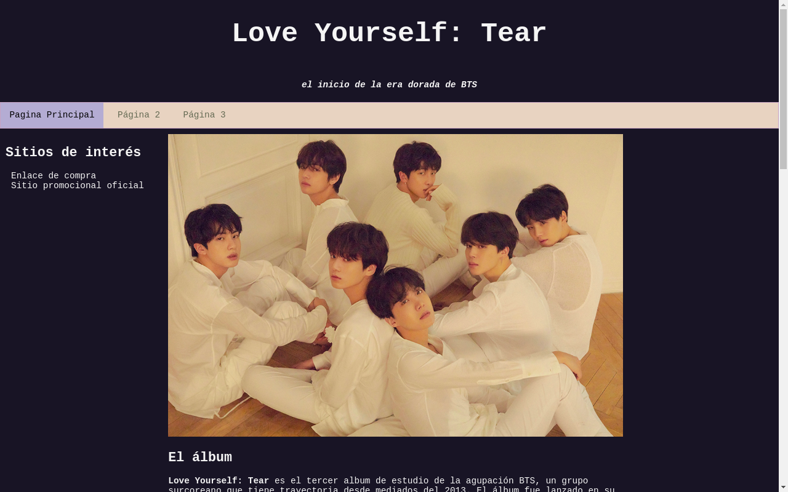
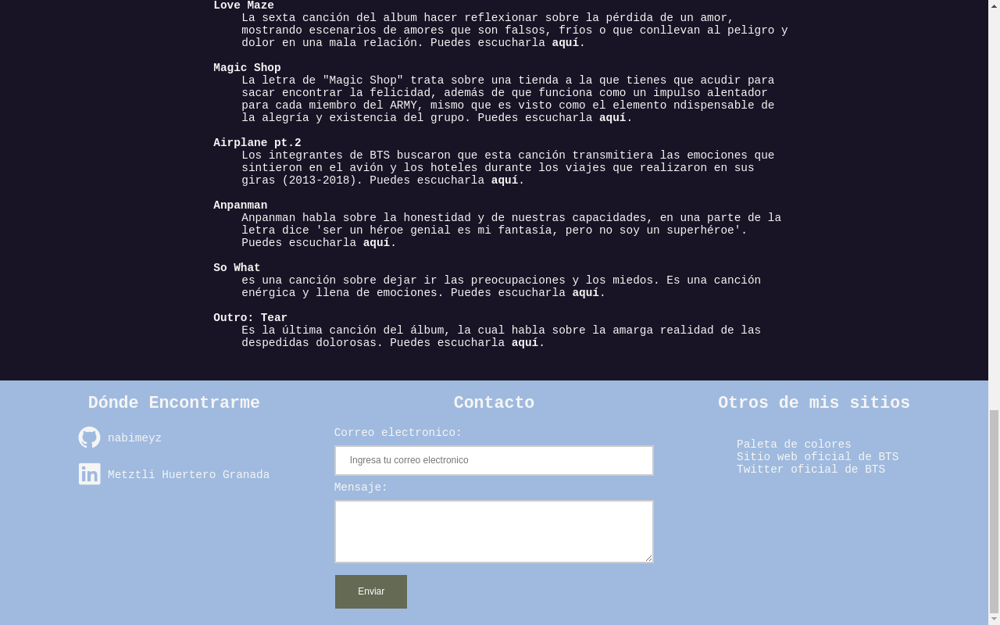
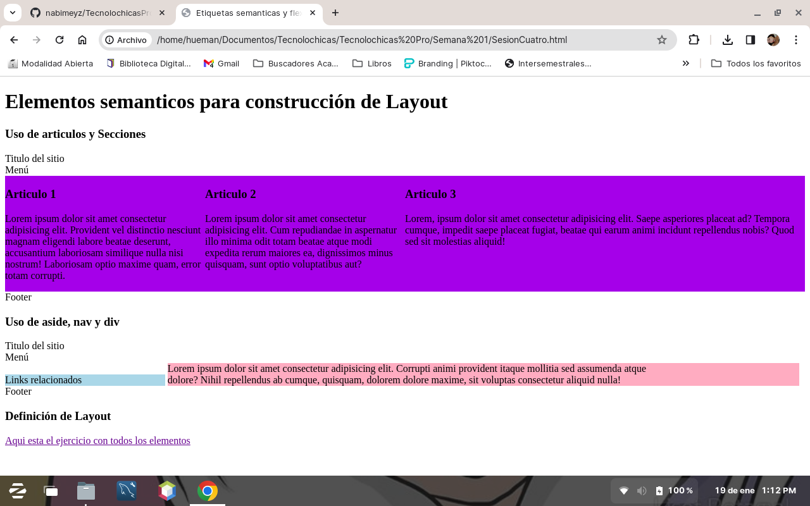

# Bienvenido al repositorio: Tecnolochicas Pro

En él, podrá encontrar los proyectos elaborados durante el programa de Tecnolochicas Pro, una iniciativa de Fundación Televisa, en 2021.
La evidencia más sobresaliente del repositorio es una *"Página tributo"* con temática de uno de mis álbumes músicales favoritos: **Love Yourself: TEAR**, del grupo surcoreano BTS.

Así mismo, podrá encontrar diferentes ejercicios realizados durante las sesiones síncronas, mediante los cuales se estudiaron las funciones de diferentes etiquetas HTML, estructura de una página web, elementos y propiedades CSS aplicados a diferentes estructuras y etiquetas semáticas.

